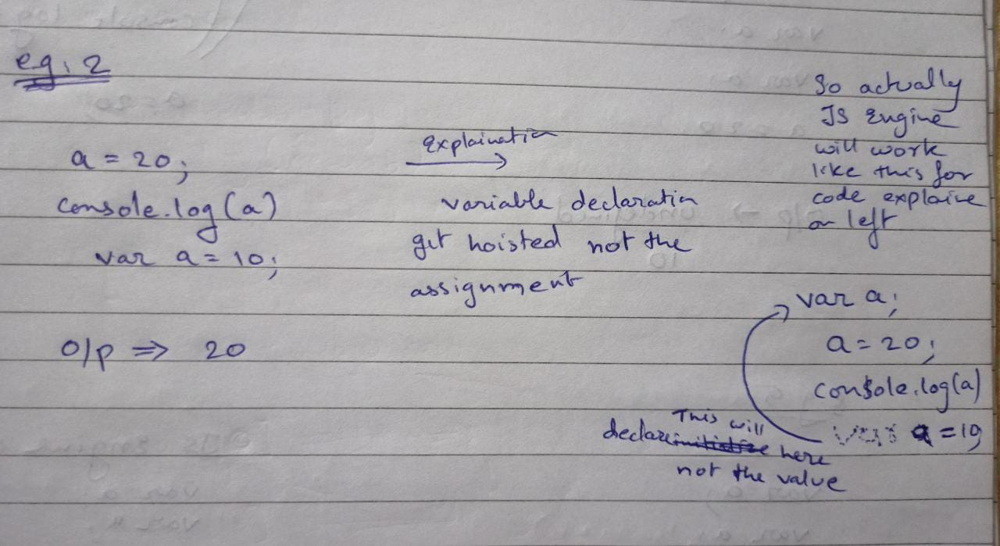

## Javascript Tech Debt

* \+ - use for both addition and concatenation.(Problems:- If any one of it is string it will return string "1" + 6 = 16) 
* == - only check the value not the datatype.(Problems:- "10" == 10  here left 10 is string and right 10 in number to avoid this === was added which checks the datatype also.)
* typeof null - It a primitive data type but it fallback to non-primitive because type of null will return object. 


## Javascript Variable

* Js is dynamic type. It means type is declared at its run time.
* Variable is a container.They are use to store data
* They can hold either primitive or non-primitive value


### Variable Declaration

- Variable in javascript can be declared using keyword as mentioned below:-
   1. **var** - can be redeclared, can be reinitialized and has functional scope. Can also get hoisted. It is es5 feature.

   ```Javascript
      var a = "Prasad";
      var a = "Prasad Tandel";

      console.log(a); //output:- Prasad Tandel
   ```
   2. **let** - let cannot be redeclared but can be reinitialized. It has lexical scope and it's es6 feature. It does not get hoisted.

   ````Javascript
      var b = 12;
      b = 4;
      console.log(b); //output:- 4
   ````  
   3. **const** - It cannot be redeclared neither reinitialize but non-primitive value can get updated. It has lexical scope and it's es6 feature. It does not get hoisted.

   ```Javascript
      const pi = 3.14;
      console.log(pi); // 3.14
   ```

### Primitive Data Type - which cannot be changed

* **string** - string are nothing but anything wrapped inside double quotes are called string

   ```javascript
     
     var a = "Prasad"; //string
     var num = "12"; // string

     console.log(a, typeof a) // output:- Prasad String
     console.log(num, typeof num) // output:- 12 String

     // String with arithmetic operation

     var num1 = 10;
     var num2 = "4";

      var add = num1 + num2;
      console.log(add) // output 104

      var sub = num1 - num2;
      console.log(sub) // output:- 6 

      var mul = num1 * num2;
      console.log(mul) // output:- 40

      var div = num1 / num2;
      console.log(div) // output:- 2.5

   ```
* **number** - we have only number in javascript wheather it a descimal value it's called as a number

```javascript

//To convert number into string we can do this way
 var num1 = 10;
  var num2 = "4";

   var add = num1 + (+ num2); //typecast easy way (+ num2)
   console.log(add) // output 104
```
* **boolean** - It contains either true or false value

   * true means 1
   * false means 0
```javascript

var nums = true;
var cost = 100;

console.log(nums + cost) //Output 101


var nums = false;
console.log(nums * cost) //Output 0
```
* **undefined** - It assign undefined to any variable that is declared but not initialized or defined.

```javascript

var x;
var y;

console.log(x + y) //NAN

var y = null;
console.log(x + y) //NAN

var y = 12
console.log(x + y) //NAN

var y = "str";
console.log(x + y) //undefinedstr
```
* **null**
* **symbol(es6)**

### Non-Primitive Data Type - Which can be changed

* **Object** - In object values are store using key value pairs. Keys are always a string and values are any primitive datatype

   ```javascript
   
   // Declaration

      var objO = {name: "prasad", exp: 1}

   // How to add key & value

      objO.age = 23;
      console.log(objO) //output:- {name: "prasad", exp:1, age:23}

   // Object can also contain non-primitive value

      objO.arr = ["JS","Linux","Python"]
      console.log(objO) //{name: "prasad", exp: 1, age: 23, arr: Array(3)}

   //To read values from object 

   // This is dot notation

   console.log(objO.arr[0]) //JS
   console.log(objO.age) //23

   // 1 - Bracket notation
   
   // 1.1 -Add key using bracket notation

   objO.["full name"] = "Prasad Tandel"

   //1.2 - call value using bracket notation

   console.log(objO.["full name"])
   ```
 * **Array** - Array is specialize object 

    ```javascript

    // How to create an array

    var arr = [2,3,4,5];
    console.log(arr);

   //How to add value in array

   arr[4] = 24;
   consol.log(arr); //output [2,3,4,5,24]
    ```

    * Length or an array is calculated as last index plus 1

### Truthy and falsy value in javascript

* Falsy value
   * number =>0, NAN
   * string => " "
   * undefined 
   * null
   * boolean => false

* Truthy value

   * all non-primitive value are truthy value
   * Primitive which are not falsy are truthy value

### Hoisting

`Hoisting means variable declaration are moved at the top and it happens at run time before code execution`




### Functional and lexcial scope

* **Functional scope**

   - If we run a function and we declare a variable it will get hoisted at the top inside function

   ```javascript

   //eg:1 

   var a ;
   var b = "ok";

   console.log(a + b);
   function hello(){
      a = 3;
      console.log(a)
      var a;
   }
   hello();

   /*output : undefinedok
              3

   Explaination - at first variable is only declared so output is undefinedok and in function variable is declared at bottom so according to es5 feature declaration get hoisted at top so var a will get declared above a = 3 
   */

      /*---------------------------------------*/

   //eg: 2

   var a;
   var b = "ok";

   console.log(a + b)
   function hello(){
      a = 20;
      console.log(a)
   }
   hello();

   /* output - undefinedok
               20

    explaination - since we have not declared var a inside function so it will search for it parent outside the function 
   */
   ```

* **Lexcical scope**

      `It start with curly bracket only and the scope of the variable is only till that block`
   
   ```javascript

      let v = true
      let a;
      if (v){
         let a = 5;
         console.log(a);
      };
      console.log(a);

      /**
      Output 5
             undefined

       explaination:- since let is lexcical scope and it is declared in if block it's scope will remain till that block only
      **/
   ```

* **Copy By Value / Pass By Value (Primitive Datatype)**
   - If we copy primitive variable they copy the actual value that they are holding

   ```javascript

      var crazy = "Prasad";
      var insane = crazy;

      console.log(crazy); // "Prasad"
      console.log(insane); // "Prasad"

      crazy = "Prasad Tandel";

      console.log(crazy); // "Prasad Tandel"
      console.log(insane); // "Prasad"

      /**explaination- Here the value for crazy and insane are store in two different memory since the copy is passed to insane and when crazy get override the value of crazy get update but insane remains same**/
   ```

* **Pass by Reference (Non-Primitive DataType)**

   - It means that it is actually passing the reference to memory location where the data is stored

   ```javascript

   var stack = {
      java: 2,
      php :20,
      go: 1
   } 

   var tech = stack;

   console.log(stack); // {java:2, php:20, go:1}

   tech.go = 10;

   console.log(tech); // {java:2, php:20, go:10}
   console.log(stack); // {java:2, php:20, go:10}

   /*Explaination - Her stack has one memory which is pointing to memory location since it is non primitive and tech has it own memory and address is pass by stack. So stack and tech both are pointing to same memory location. Now make any changes in stack or tech changes will happen at same memory location*/
   ```